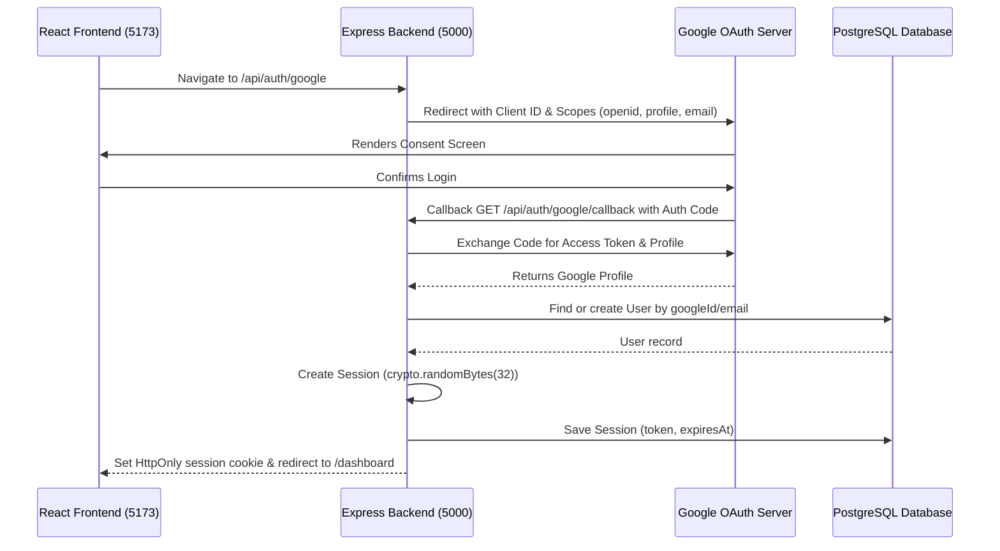

# ReachInbox Email Scheduler

Production-grade email scheduling service built as a monorepo. The completed assignment combines a React dashboard, an Express API, PostgreSQL persistence, Redis/BullMQ delayed jobs, and a separate Ethereal SMTP worker.

## Project Overview

ReachInbox Email Scheduler schedules one durable email job per recipient. **PostgreSQL is the durable source of truth** for users, senders, campaigns, and delivery state; Redis/BullMQ provides persistent delayed execution and shared rate-limit coordination.

## Tech Stack

| Layer | Technologies |
|-------|-------------|
| **Backend** | Node.js, Express, TypeScript (ESM), Prisma, PostgreSQL, Zod, Pino, Helmet, Cors, ioredis |
| **Frontend** | React, Vite, TypeScript, Tailwind CSS, React Router, Axios, TanStack Query |
| **Infrastructure** | Docker Compose, PostgreSQL, Redis |
| **Tooling** | npm workspaces, ESLint, Prettier, Vitest, Supertest |

---

## Backend Architecture

The backend follows a strict layered pattern:

```
Request ──> Route ──> Middleware ──> Controller ──> Service ──> Repository ──> Prisma ──> PostgreSQL
```

- **Routes**: Declare route mappings and define validation checks.
- **Middleware**: Intercepts requests for logging (Pino), request ID injection, input validation (Zod), and rate-limiting.
- **Controllers**: Handle HTTP-specific details only. They parse requests, call services, and return responses.
- **Services**: Contain domain business logic and rules.
- **Repositories**: Execute raw database actions through Prisma.
- **Prisma & PostgreSQL**: Database schema and persistence.

### Key Backend Rules:
- Repositories return safe fields only (e.g. omitting `smtpPassword` properties).
- Controllers do not call Prisma directly.
- Centralized error handler maps Prisma errors (P2002 Unique Constraint, P2025 Not Found) to standard HTTP errors (409 Conflict, 404 Not Found), preventing leaks of server stack traces or SQL details in production.

---

## API Routes

| Endpoint | Method | Parameters/Query | Description |
|---|---|---|---|
| `/api/health` | GET | None | Check API, Postgres, and Redis health |
| `/api/health/queue` | GET | None | Check BullMQ queue counters and rate-limited job count |
| `/api/users/:id` | GET | UUID | Get user details (Dev only) |
| `/api/users/:id/senders` | GET | UUID | Get senders for a user (Dev only) |
| `/api/users/:id/campaigns` | GET | UUID | Get campaigns for a user (Dev only) |
| `/api/senders` | GET | `?userId={UUID}` | List senders of a user (excludes password) |
| `/api/senders` | POST | JSON Body | Configure a new sender (excludes password in output) |
| `/api/senders/:id` | GET | UUID | Retrieve single sender (excludes password) |
| `/api/senders/:id` | PATCH | UUID, JSON Body | Update safe sender parameters (strict validation) |
| `/api/campaigns` | GET | `?userId={UUID}` (Optional) | List campaigns |
| `/api/campaigns/:id` | GET | UUID | Get specific campaign details |
| `/api/campaigns/:id/emails` | GET | UUID, `?page=&limit=&senderId=&status=` | Get paginated email jobs of campaign |
| `/api/campaigns/:id/stats` | GET | UUID | Get campaign stats |
| `/api/email-jobs/scheduled` | GET | `?page=&limit=&campaignId=&senderId=&status=` | Paginated scheduled/processing jobs |
| `/api/email-jobs/sent` | GET | `?page=&limit=&campaignId=&senderId=&status=` | Paginated sent/failed jobs |
| `/api/email-jobs/:id` | GET | UUID | Get single email job details |

---

## Folder Structure

```
reachinbox-email-scheduler/
├── backend/
│   ├── prisma/
│   │   ├── schema.prisma       # Database models
│   │   └── seed.ts             # Development seed data
│   ├── src/
│   │   ├── config/             # Config variables (env, database, redis, logger)
│   │   ├── controllers/        # Express handlers (health, user, sender, campaign, emailJob)
│   │   ├── middleware/         # Request handling filters (errorHandler, validation, requestLogger, rateLimit)
│   │   ├── repositories/       # Encapsulated database operations
│   │   ├── routes/             # Route mapping definitions
│   │   ├── schemas/            # Zod validation schemas
│   │   ├── services/           # Domain business operations
│   │   ├── types/              # Clean model & collection DTO typescript declarations
│   │   ├── utils/              # Common helpers (apiError, response format, pagination)
│   │   ├── app.ts              # App configurations (Helmet, CORS, body limits)
│   │   └── server.ts           # Server start & shutdown listeners
│   ├── openapi.yaml            # REST API Swagger specification
│   └── package.json
├── frontend/
├── docker-compose.yml
└── package.json
```

## Prerequisites

- **Node.js** >= 20
- **npm** >= 10
- **Docker** and **Docker Compose**

## Installation

```bash
cd reachinbox-email-scheduler
npm install

cp backend/.env.example backend/.env
cp frontend/.env.example frontend/.env
```

---

## Database Setup

### 1. Start Docker (PostgreSQL + Redis)

```bash
docker compose up -d
docker compose ps
```

### 2. Generate Prisma Client

```bash
npm run db:generate
```

### 3. Run Migrations

```bash
npm run db:migrate
```

### 4. Seed Development Data

```bash
npm run db:seed
```

---

## Running the Project

### Start Backend

```bash
npm run dev:backend
```
Backend runs at **http://localhost:5000**.

### Start Frontend

```bash
npm run dev:frontend
```
Frontend runs at **http://localhost:5173**.

### Run Both Simultaneously

```bash
npm run dev
```

### Execute Tests

```bash
npm run test
```
Runs Vitest unit and API integration tests.

---

## Health API

**Endpoint:** `GET /api/health`

```bash
curl http://localhost:5000/api/health
```

**Expected output:**

```json
{
  "success": true,
  "data": {
    "status": "healthy",
    "services": {
      "api": "up",
      "database": "connected",
      "redis": "connected"
    },
    "timestamp": "2026-08-19T11:00:00.000Z"
  }
}
```

---

## Authentication & Session Architecture (Phase 4)

Phase 4 adds secure Google OAuth 2.0 and server-side session-based authentication to the application, eliminating any client-side localStorage token security risks.



### 1. Database Session Model
We introduced a `Session` model in Prisma backing session persistence durably:
- `id` (UUID, primary key)
- `userId` (foreign key to `User`, cascade deletes on user deletion)
- `sessionToken` (cryptographically secure random token, unique, index)
- `expiresAt` (expiry timestamp, indexed)

### 2. Cookie Security
The backend sets the session token as a secure browser cookie:
- **HttpOnly**: Shielded from browser JavaScript access (mitigates XSS token leakage).
- **Secure**: Transmitted only over HTTPS (configured for production).
- **SameSite=Lax**: Prevents CSRF cross-origin forgery while allowing smooth redirection loops on callback.
- **Path=/**: Sent on all backend requests.

### 3. Google OAuth Setup
To set up local Google OAuth:
1. Open the [Google Cloud Console](https://console.cloud.google.com/).
2. Create or select a project.
3. Configure the **OAuth Consent Screen** (specify app name, support email, and scopes: `openid`, `profile`, `email`).
4. Navigate to **Credentials** -> **Create Credentials** -> **OAuth Client ID**.
5. Select Application Type: **Web application**.
6. Set Authorized JavaScript Origins:
   - `http://localhost:5173`
7. Set Authorized Redirect URIs:
   - `http://localhost:5000/api/auth/google/callback`
8. Obtain the generated Client ID and Client Secret, then insert them in `backend/.env`:
   ```env
   GOOGLE_CLIENT_ID=your_client_id_here
   GOOGLE_CLIENT_SECRET=your_client_secret_here
   GOOGLE_CALLBACK_URL=http://localhost:5000/api/auth/google/callback
   ```

### 4. Why this Architecture is Secure
- **PostgreSQL Sessions**: By persisting sessions durably in PostgreSQL (rather than memory), session validation scales gracefully, handles server restarts without logging out users, and supports manual session cleanup.
- **Independent Session Tokens**: The session cookie contains a secure application-specific token generated via `crypto.randomBytes(32)` instead of Google's OAuth tokens. The backend never logs or exposes Google tokens.
- **No localStorage**: Session cookies are processed by the browser automatically and cannot be accessed by scripts, preventing access token theft.
- **Data Authorization Scoping**: Every API route retrieves details using `req.user.id`. Scopes for Senders, Campaigns, and EmailJobs verify owner-relations at the repository query level. Querying a resource belonging to another user returns `404 RESOURCE_NOT_FOUND` to protect resource existence disclosure.

---

## Security Notes

- `smtpPassword` is **never** returned by sender queries.
- Requests check/assign standard `X-Request-ID` and return it in headers.
- Large JSON request bodies are limited to `1mb`.
- CORS configuration uses `FRONTEND_URL` and `credentials: true` to support session cookies.
- Sensitive parameters are shielded from logs.

---

## Phase 5: Campaign Creation & Lead Processing

Phase 5 implements campaign creation and lead file validation/processing pipelines.

### 1. Recipient Parsing & Normalization
* **CSV Files**: Parsed using `papaparse`. It matches an `email` header (case-insensitive) if present, or falls back to scanning all properties of each row for the first string matching a standard email format.
* **TXT Files**: Split by newlines, spaces, commas, or semicolons to extract email candidates.
* **Normalization**: Trims spaces, lowercases email casing, and strips surrounding single/double quotes.
* **Deduplication**: Suppresses duplicates within the lead list. If zero valid emails are found, the request fails with a `400 NO_VALID_RECIPIENTS` error.

### 2. Transaction Safety & UTC Scheduling
* **Atomic Transaction**: Enforced inside Prisma `$transaction` block. The `Campaign` and all associated `EmailJob` records are created together. If any insert fails, the transaction is **rolled back completely** to avoid orphaned records.
* **Send Time Calculation**: Initial job schedule times are calculated as:
  $$\text{scheduledAt} = \text{startTime} + (\text{index} \times \text{delayMs})$$
* **UTC Timezone Policy**: All timestamps are validated, converted, and stored in PostgreSQL as Coordinated Universal Time (UTC) to ensure multi-node scheduling consistency.

---

## Phase 6: Persistent BullMQ + Redis Delayed Job Scheduling

Phase 6 implements the background scheduling queue integration layer connecting our database model to BullMQ delayed queues.

```
POST /api/campaigns
   ↓
PostgreSQL Campaign + EmailJob records (SCHEDULED)
   ↓
BullMQ Scheduler (addBulk)
   ↓
Redis Queue (Delayed jobs)
   ↓
Background Worker (dev:worker / start:worker)
```

### 1. Core Scheduling Rules
* **PostgreSQL is the source of truth**: Emails are never stored solely in Redis. Redis holds reference parameters to manage when a job is sent.
* **Deterministic Job IDs**: BullMQ job IDs map directly to PostgreSQL jobs as `email:<emailJob.id>`. This prevents duplicate enqueuing.
* **Payload Isolation**: BullMQ job data contains only reference pointers:
  ```json
  {
    "emailJobId": "...",
    "campaignId": "...",
    "senderId": "..."
  }
  ```
  Sensitive information like email bodies or SMTP credentials are never stored in Redis.
* **Reconciliation Support**: Exposes the `ensureEmailJobScheduled` hook (and matching `/api/internal/email-jobs/:id/ensure-scheduled` dev route) to verify job state in Redis and recreate missing jobs without duplicate queue insertions.
* **API / Worker Process Separation**: The Express API process (`server.ts`) and worker process (`worker.ts`) run independently, allowing independent horizontal scaling.

### 2. Queue Configuration & Retention
* Queue Name: `email-sending`
* Attempts: `3` (retries are managed with an exponential backoff policy)
* Job Removal Options:
  - `removeOnComplete`: 1000 records kept (retains history for short-term tracking and debug).
  - `removeOnFail`: 5000 records kept (prevents Redis memory growth while keeping details on failures).
* **Redis Durability**: Development setups utilize Docker Redis with volume persistence (`redis_data:/data`) to ensure scheduled queues survive container restarts.

---

## Development Scripts (Phase 6)
- **`npm run dev:api`**: Launches the Express REST API server.
- **`npm run dev:worker`**: Launches the background BullMQ worker process.
- **`npm run start:worker`**: Launches the worker process in production compiled mode.
- **`npm run queue:inspect`**: Logs a JSON payload of current Redis queue counters.
- **`npm run test:queue`**: Runs the BullMQ Vitest test suite.

*Note: Rate limiting is implemented in Phase 8.*

## Deployment

The intended deployment has three independently running application services:

```text
             Google OAuth
               |
               v
           +-------------------+
           | React/Vite static |
           | frontend          |
           +---------+---------+
               | HTTPS + cookies
               v
           +-------------------+
           | Express API       |
           +----+---------+----+
             |         |
             v         v
         PostgreSQL    Redis/BullMQ
         source truth       |
                  v
               Separate worker
                  |
                  v
               Ethereal SMTP
```

Deploy the backend API and worker from the compiled backend package. The API uses `npm run start`; the worker uses `npm run start:worker`. Deploy the frontend as static Vite output using `npm run build`. Production must use PostgreSQL, persistent Redis, `NODE_ENV=production`, real Google OAuth credentials, and Ethereal SMTP credentials. Use `npx prisma migrate deploy` during release, never `prisma migrate dev` or `prisma db push` against production.

The included `backend/Dockerfile` builds and runs the API image. A separate worker service should use the same image with its command overridden to `node dist/worker.js`. The root Compose file is a development/evaluator dependency stack only; it contains PostgreSQL and Redis with persistent volumes and no application secrets.

For a cross-site frontend/API deployment, set `SESSION_COOKIE_SAME_SITE=none` and serve the API over HTTPS. This keeps the cookie `HttpOnly` and requires `Secure=true` through the production cookie configuration. Keep `FRONTEND_URL` set to the exact frontend origin; CORS is not wildcard-enabled. Google settings must use the production callback `https://api.example.com/api/auth/google/callback` and the production frontend URL, while local development uses the localhost callback shown in `backend/.env.example`.

### Environment Variables

Every backend variable is listed in [backend/.env.example](backend/.env.example), including database, Redis password, OAuth, session, SMTP, queue, upload, and rate-limit settings. The frontend only needs `VITE_API_URL`, for example `https://api.example.com/api`. Never commit `.env` files or credentials.

### Assignment Requirement Mapping

Implemented in code: TypeScript, Express, PostgreSQL, Prisma, Redis, BullMQ, delayed scheduling, separate worker, Ethereal integration, configurable concurrency, Lua hourly/minimum-delay limits, CSV/TXT parsing, deduplication, transactional campaign creation, deterministic job IDs, schedule versions, ownership checks, Google OAuth sessions, dashboard, compose flow, scheduled/sent views, pagination, previews, loading, empty, error, and responsive states.

Verified locally: backend/frontend builds, backend/frontend lint, Prisma migration status, PostgreSQL-backed authentication/authorization/API/campaign/parser/transaction tests, production artifacts, and security/configuration inspection.

Runtime verification still requiring infrastructure: Google OAuth browser flow, Ethereal delivery, Redis/BullMQ worker execution, API/worker restart persistence, multi-worker rate limits, Redis outage recovery, and 1000-job queue load. See [TEST_REPORT.md](TEST_REPORT.md) for the evidence and exact status.

### Final Submission

Use [DEMO.md](DEMO.md) as the five-minute demonstration script, [INTERVIEW_NOTES.md](INTERVIEW_NOTES.md) for technical discussion, and [TEST_REPORT.md](TEST_REPORT.md) for the audit record. This workspace does not contain a Git repository or GitHub credentials, so private repository creation and evaluator access must be completed by the owner.

## Phase 10 Readiness and Operations

PostgreSQL is the durable source of truth. Campaign creation commits the campaign and all recipient jobs in one Prisma transaction, then inserts deterministic BullMQ delayed jobs. Redis and PostgreSQL are separate systems, so queue insertion is retryable and reconciliation-safe rather than a distributed transaction. Worker claims are atomic, schedule versions reject stale executions, and Redis Lua scripts enforce sender-scoped hourly and minimum-delay reservations across workers.

The API exposes `GET /api/health` and `GET /api/health/queue`. Run the local infrastructure with:

```bash
docker compose up -d
docker compose ps
docker compose logs -f postgres redis
docker compose down
```

For a final demo, configure Google OAuth and Ethereal SMTP in `backend/.env`, use `VITE_API_URL=http://localhost:5000/api` in `frontend/.env`, and run the API, worker, and frontend independently. The session cookie is HTTP-only and Secure in production. Do not expose development error stacks publicly.

The Phase 10 audit found and fixed a rate-limit accounting issue: a minimum-delay denial now releases the hourly reservation atomically instead of consuming hourly capacity for an email that was not sent. Full Redis/BullMQ/SMTP restart and multi-worker tests require a running Docker/Redis environment and are recorded in [TEST_REPORT.md](TEST_REPORT.md) with their actual status.

See [DEMO.md](DEMO.md) for the five-minute presentation script and [INTERVIEW_NOTES.md](INTERVIEW_NOTES.md) for the consistency, reliability, security, and exactly-once delivery trade-offs.

---

## Phase 7: BullMQ Email Worker & Ethereal SMTP Delivery Layer

Phase 7 implements the background worker processing loop and Ethereal SMTP mail delivery layer.

```
BullMQ Delayed Job
       ↓
BullMQ Worker (worker.ts)
       ↓
Verify Database Claim (SCHEDULED -> PROCESSING)
       ↓
EmailService (email.service.ts)
       ↓
SMTPService (smtp.service.ts)
       ↓
Nodemailer (reusable transporter)
       ↓
Ethereal SMTP (smtp.ethereal.email)
       ↓
Update Database (SENT / FAILED) + Campaign Counters
```

### 1. Email Worker Architecture
The worker runs inside an isolated process (`worker.ts`) and listens to the `email-sending` queue.
- **Transporter Reuse**: A single instance of a Nodemailer transporter is reused per worker process instead of opening socket connections for every message.
- **Fail-Fast Boot**: Upon starting up, the worker tests the SMTP server connectivity via `smtpService.verifyConnection()`. If verification fails (e.g. missing credentials), the process exits immediately with a clear error without accepting jobs.
- **Log Security**: SMTP passwords, tokens, and email bodies are explicitly suppressed from logs. Only job IDs and recipient emails are cautiously logged.

### 2. State Machine & Atomic Claims
Jobs transition through states durably:
$$\text{SCHEDULED} \longrightarrow \text{PROCESSING} \longrightarrow \text{SENT} \text{ or } \text{FAILED}$$
1. **Atomic Claim Check**: Before dispatching, the worker runs an atomic conditional query in PostgreSQL:
   ```sql
   UPDATE email_jobs
   SET status = 'PROCESSING', attempts = attempts + 1, "lastAttemptAt" = NOW()
   WHERE id = $1 AND status = 'SCHEDULED';
   ```
   If 0 rows are updated, the job has already been claimed by another worker and this attempt exits instantly without sending.
2. **Campaign Running Transition**: When the first job of a campaign transitions to `PROCESSING`, the campaign's status changes from `SCHEDULED` to `RUNNING`.
3. **Transactional Terminal Updates**: Setting job status to `SENT` or `FAILED` and updating the campaign counters (`sentCount`, `failedCount`, `scheduledCount`) occurs inside a single database transaction. When all jobs are complete, the campaign transitions to `COMPLETED` (or `PARTIALLY_FAILED` if any email failed).

### 3. Error Classification & Retry Policy
Errors caught during mail delivery are sorted into distinct categories:
- **`RetryableEmailError`**: Transient network timeouts, socket disconnects, or temporary SMTP outages. These errors are thrown to let BullMQ execute exponential retries.
- **`PermanentEmailError`**: Authentication rejections, malformed email formatting, or rejected envelope recipient addresses. These fail immediately, marking the job status as `FAILED` in the database without performing retries.
* **Retry configuration**: Max attempts = `3`, exponential backoff delay = `5000`ms. If retries are exhausted, the job transitions to `FAILED`.

### 4. Ethereal SMTP & Preview URLs
- Ethereal SMTP is a fake SMTP testing service. When mail is accepted, Ethereal returns a preview URL.
- The worker captures this URL (`nodemailer.getTestMessageUrl(info)`) and stores it in the `previewUrl` column in PostgreSQL.
- API endpoints `GET /api/email-jobs/sent` and `GET /api/email-jobs/:id` expose the `previewUrl` but completely sanitize internal fields like `bullJobId` and SMTP passwords.

### 5. Delivery Semantics (Exactly-Once Tradeoffs)
> [!IMPORTANT]
> **Exactly-Once delivery cannot be perfectly guaranteed** with external SMTP servers and databases due to the Two-Phase Commit problem.
> For example, if a worker successfully sends a message via SMTP but crashes before committing the `SENT` status to the database, the job will remain as `PROCESSING`. 
>
> To handle this:
> - **BullMQ uniqueness** guarantees that each job ID (`email:<id>`) is queued exactly once in Redis.
> - **Atomic DB claims** prevent concurrent workers from claiming the same job.
> - **Graceful worker shutdown** (`SIGINT`/`SIGTERM`) stops accepting new jobs and waits for active sends to finish before disconnecting database connections.
> - If a worker crashes, the job remains `PROCESSING` and can be manually recovered or retried after checking logs to avoid duplicate-send loops.

---

## Ethereal SMTP Setup Guide

To verify email delivery manually:
1. Open [Ethereal Email](https://ethereal.email/) and click **Create Ethereal Account**.
2. Copy the generated configuration details:
   - **Mail Host**: `smtp.ethereal.email`
   - **Port**: `587`
   - **Username**: (e.g. `user123@ethereal.email`)
   - **Password**: (e.g. `pass123`)
3. Open `backend/.env` and fill in the values:
   ```env
   SMTP_HOST=smtp.ethereal.email
   SMTP_PORT=587
   SMTP_SECURE=false
   SMTP_USER=your_ethereal_user
   SMTP_PASS=your_ethereal_password
   EMAIL_FROM_ADDRESS=your_ethereal_user
   ```
4. Start the API and Worker:
   ```bash
   npm run dev:api
   npm run dev:worker
   ```
5. Trigger campaign creation. Once the scheduled time occurs, the worker will process the job, and the `/api/email-jobs/sent` endpoint will return a valid `previewUrl` link where you can view the sent email contents!


